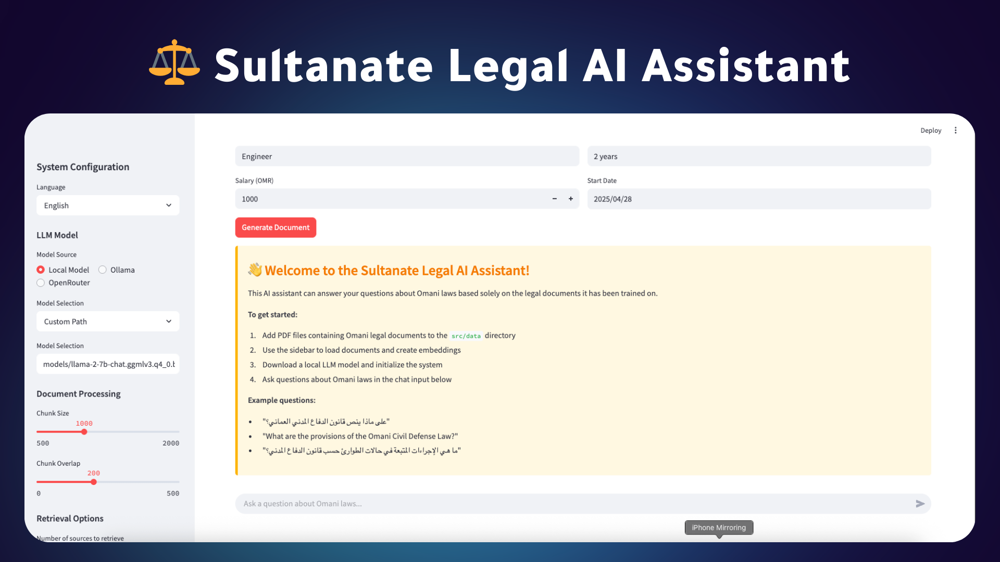

# 🔍 Omani Legal AI Assistant | مساعد الذكاء الاصطناعي القانوني العماني



## 🌟 نبذة عن المشروع | About the Project

نظام ذكاء اصطناعي متقدم لمساعدة المحامين والباحثين القانونيين في عمان. يستخدم هذا النظام تقنيات معالجة اللغة الطبيعية المتقدمة وتقنيات الذكاء الاصطناعي لتحليل وفهم المستندات القانونية باللغتين العربية والإنجليزية.

*An advanced AI system designed to assist lawyers and legal researchers in Oman. This system leverages cutting-edge natural language processing and AI technologies to analyze and understand legal documents in both Arabic and English.*

## ✨ المميزات | Features

- 📚 **استعلام المستندات | Document Q&A**: طرح أسئلة حول المستندات القانونية والحصول على إجابات دقيقة مدعومة بالمراجع
  
  *Ask questions about legal documents and receive accurate, referenced answers*

- 📝 **تلخيص المقالات | Article Summarizer**: تلخيص المقالات والنصوص القانونية بشكل آلي مع الحفاظ على المعنى الأساسي
  
  *Automatically summarize legal articles and texts while preserving their core meaning*

- ⚖️ **مقارنة القوانين | Law Comparison**: مقارنة مواد قانونية مختلفة وتحليل الاختلافات والتشابهات بينها
  
  *Compare different legal provisions and analyze their differences and similarities*

- 📄 **إنشاء المستندات | Document Creator**: إنشاء مستندات قانونية جديدة بناءً على المتطلبات المحددة
  
  *Create new legal documents based on specific requirements*

- 🔎 **تحليل القضايا | Case Analyzer**: تحليل القضايا القانونية وتقديم رؤى وتوصيات استراتيجية
  
  *Analyze legal cases and provide strategic insights and recommendations*

## 🛠️ متطلبات النظام | System Requirements

- 🐍 Python 3.8+
- 🔑 مفتاح API من OpenAI | OpenAI API Key
- 💻 نظام تشغيل متوافق (Windows/macOS/Linux) | Compatible operating system

## 📥 طريقة التثبيت | Installation

1. استنساخ المستودع | Clone the repository:
```bash
git clone https://github.com/yourusername/PdfIntelligence.git
cd PdfIntelligence
```

2. تثبيت المتطلبات | Install requirements:
```bash
pip install -r requirements.txt
```

3. إنشاء ملف `.env` في المجلد الرئيسي وإضافة مفتاح API الخاص بك | Create a `.env` file in the root directory and add your API key:
```
OPENAI_API_KEY=your_openai_api_key_here
```

## 🚀 طريقة التشغيل | How to Run

تشغيل التطبيق | Run the application:
```bash
streamlit run app.py
```

سيكون التطبيق متاحًا على الرابط | The application will be available at: http://localhost:8501

## 💡 نصائح للاستخدام | Usage Tips

- قم بتحميل ملفات PDF القانونية الخاصة بك للبدء | Upload your legal PDF files to get started
- يمكنك التبديل بين اللغتين العربية والإنجليزية في أي وقت | You can switch between Arabic and English at any time
- استخدم خاصية البحث للعثور على معلومات محددة بسرعة | Use the search feature to quickly find specific information

## 🔒 الأمان والخصوصية | Security and Privacy

- جميع البيانات تتم معالجتها محليًا على جهازك | All data is processed locally on your device
- لا يتم تخزين المستندات القانونية على خوادم خارجية | Legal documents are not stored on external servers
- تشفير كامل لجميع الاتصالات مع واجهات API | Full encryption for all API communications
